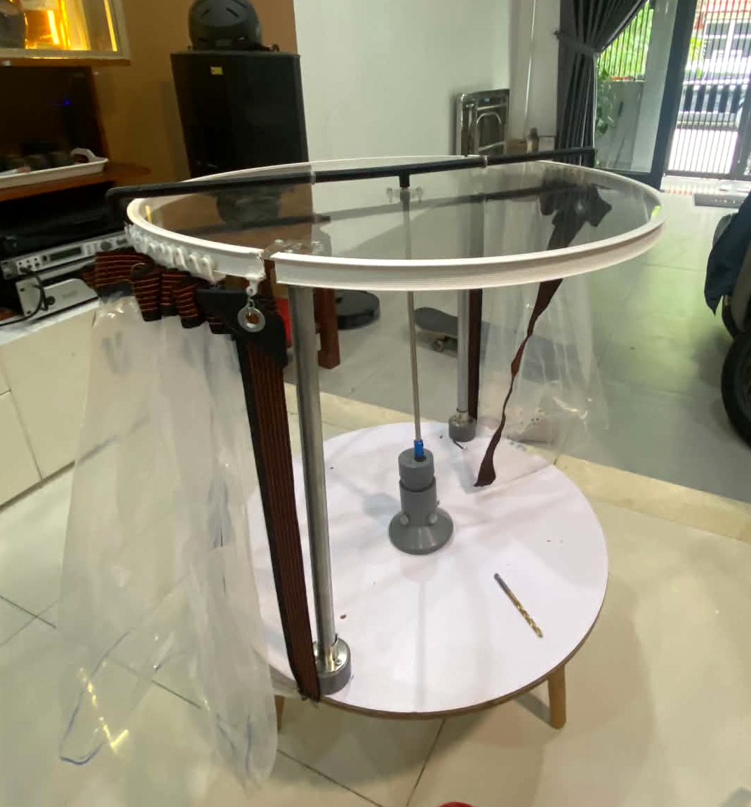
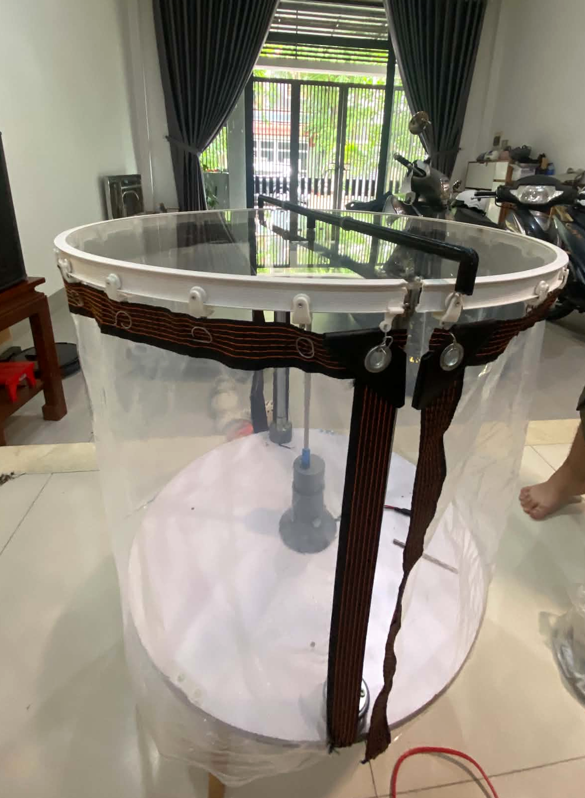

# 🌿 GreenGuard

GreenGuard is an automatic plant-protection shield built around a **NodeMCU 1.0 (ESP-12E Module / ESP8266)**. It reads a digital rain sensor and drives a motor to deploy or retract the shield. The completed prototype was the final hands-on output of a three-month introductory embedded-systems course.

## How GreenGuard Began

GreenGuard began as a small course for friends who were also learners. The tutors represented by [`quanle0709`](https://github.com/quanle0709) and [`nhiennguyenquoc`](https://github.com/nhiennguyenquoc) initiated and guided the learning experience as embedded-systems tutors, instructors, project mentors, and technical guides.

The purpose was not to create a startup, commercial product, or formal research invention. It was to help a learner understand embedded systems through practice and see what studying a related university field might actually involve.

## Learning by Building

Our group learned by connecting each concept to something physical. The tutors shaped the learning process, explained the underlying ideas, provided technical direction, helped solve problems, and supervised integration and testing. The learner was not a passive observer: after three months of learning and experimenting, the learner directly built, integrated, debugged, and tested the final GreenGuard prototype under their guidance.

GreenGuard became our way of answering a practical question: how do a sensor, a microcontroller, a motor driver, and a real mechanism work together? The answer involved more wiring than we first expected :)))

### What the Learner Practiced

- Understanding the role of a microcontroller in an embedded system.
- Reading a digital sensor signal and connecting that input to actuator behavior.
- Controlling a DC motor through a BTS7960/HW-039 motor driver.
- Working with GPIO, voltage levels, motor power, and a shared logic reference.
- Writing firmware that reacts to real-world input without blocking its main loop.
- Distinguishing automatic control from manual control.
- Integrating firmware with a local web dashboard.
- Debugging hardware and software as one system.
- Measuring voltage, current, timing, and temperature instead of assuming the system is safe.
- Getting a realistic first look at embedded systems and related engineering fields.

## The Final Course Project

The learner assembled the mechanical structure, integrated the electronics and firmware, worked through faults, and helped test the completed prototype. It definitely did not work immediately on the first attempt :3, which made the debugging part just as valuable as the finished result.

<p align="center">
  
</p>
<p align="center"><em>The completed GreenGuard prototype after three months of embedded-systems learning and hands-on development.</em></p>

We completed the physical GreenGuard prototype, applied the updated working firmware, and performed the recorded physical validation on **June 26, 2026**. We updated and published the repository on GitHub on **August 26, 2026**. These are separate milestones: June records the completed build and physical test, while August records the repository update.

## What GreenGuard Can Do

- Qualify rain input without blocking: the defaults require 3 seconds of wet input and 120 seconds of dry input.
- In AUTO, deploy the shield after a qualified wet state; retract only after a qualified dry state when a position estimate is available.
- In MANUAL, provide explicit deploy, retract, Emergency Stop, and Reset Fault commands.
- Switch both PWM paths off before changing direction and enforce a configured 300 ms reversal dead-time.
- Apply a motor-runtime limit, fault lockout, LittleFS state persistence, and `UNKNOWN` recovery after an interrupted movement.
- Serve a responsive Vietnamese dashboard directly from the ESP8266 with request IDs and separate received, started, and completed phases.
- Optionally require a LAN control token while keeping AUTO protection local when Wi-Fi or the browser is unavailable.
- Resist duplicate actions caused by double-clicks or delayed acknowledgements.

The public repository intentionally keeps `ACTUATOR_DRY_RUN=true`. The state machine runs, but RPWM and LPWM remain LOW. `CONTROL_BTS_ENABLE=false` also means the public build does not configure or drive D2 as an enable output. Our physical prototype test used a local actuator-enabled configuration that was not committed.

## How It Works

```text
RainDrop DO
     │
     v
qualify WET/DRY ──> ESP8266 state machine ──> interlock + timeout ──> BTS7960 ──> motor
                              │
                              ├──> LittleFS state and configuration
                              └──> REST API + dashboard on the local network
```

The browser observes state and submits requests. The ESP8266 decides whether a command is valid. The dashboard must never treat “HTTP request received” as “the shield finished moving.”

## Physical Prototype

<p align="center">
  
</p>
<p align="center"><em>A front view of the prototype showing its mechanical frame and shield-driving components.</em></p>

These photographs show our completed physical prototype. They are not standalone proof of the ten-cycle test, the electrical measurements, or every system function; our recorded validation results below are the evidence for those claims.

## Measured Validation

We completed the prototype, applied the updated working firmware to the confirmed NodeMCU 1.0 ESP-12E, and performed the physical validation on **June 26, 2026**. We recorded the following measurements during that test; they are not estimates:

| Measurement | Result |
| --- | ---: |
| Continuous deploy–retract testing | 10 cycles with the real mechanical load |
| Motor supply before movement | 12.18 V |
| Motor supply during movement | 11.72 V |
| Supply voltage drop | 3.8% |
| Lowest 3V3 rail during motor startup | 3.17 V |
| NodeMCU resets during testing | None |
| Rain sensor DO when dry | 3.27 V |
| Rain sensor DO when wet | 0.08 V |
| Rain sensor logic | Active-LOW |
| Motor current during loaded movement | 2.63 A |
| Maximum measured startup current | 7.20 A |
| Measured reversal dead-time | 307 ms |
| Highest motor temperature after 10 cycles | 51°C |
| Wire and connector temperature after 10 cycles | 34°C |
| Overall evaluation | **PASS with conditions within this test scope** |

The prototype passed functional and electrical observation for 10 consecutive loaded deploy–retract cycles. The 3V3 rail remained stable enough during the observed startup events, and the NodeMCU did not reset. RainDrop DO was confirmed as active-LOW and remained within the ESP8266 GPIO voltage range during this test. The measured 307 ms reversal dead-time closely matched the configured 300 ms target.

“PASS with conditions” matters. Ten cycles do not establish long-term endurance, outdoor weather resistance, ingress protection, every obstruction condition, or full-lifetime reliability. A successful test session should not be turned into a claim that the prototype is fully safe or commercially proven.

## Hardware

| Component | Status |
| --- | --- |
| NodeMCU 1.0 (ESP-12E Module), ESP8266 | Confirmed; PlatformIO `nodemcuv2` |
| BTS7960 / HW-039 motor driver | Confirmed on the prototype |
| 12 V DC geared motor | Confirmed on the prototype |
| RainDrop rain sensor using active-LOW DO | Confirmed; measured at 3.27 V dry and 0.08 V wet |
| 12 V, 10 A power supply | Confirmed on the prototype |
| XL4005 step-down module | Confirmed on the prototype |
| Retracted and deployed limit-switch connections | Confirmed on D7/GPIO13 and D0/GPIO16; public firmware handling remains disabled |

### Confirmed As-Built Wiring

We assembled and tested the prototype with the following NodeMCU pin mapping. The table records the physical connections used in our completed GreenGuard build.

| NodeMCU pin | GPIO | Physical connection | Function / observed status |
| --- | ---: | --- | --- |
| D1 | GPIO5 | RainDrop DO | Active-LOW; measured 3.27 V dry and 0.08 V wet |
| D5 | GPIO14 | BTS7960 RPWM | Motor-direction PWM input used by our prototype |
| D6 | GPIO12 | BTS7960 LPWM | Opposite motor-direction PWM input used by our prototype |
| D2 | GPIO4 | BTS7960 R_EN and L_EN control | Physically connected; public firmware control is disabled |
| D7 | GPIO13 | Retracted limit-switch connection | Physically connected; public limit handling is disabled |
| D0 | GPIO16 | Deployed limit-switch connection | Physically connected; public limit handling is disabled |

D3/GPIO0, D4/GPIO2, and D8/GPIO15 are ESP8266 boot-strapping pins, so the default profile avoids them. Read the [confirmed wiring record](WIRING.md) and [hardware record](docs/HARDWARE_AUDIT.md) before changing wiring or output configuration.

Physical wiring and public firmware configuration are different facts. The D2, D7, and D0 connections exist on our prototype, while `CONTROL_BTS_ENABLE=false` and `USE_LIMIT_SWITCHES=false` remain the committed safe defaults. We have not reported limit-switch contact polarity, calibration, or endpoint accuracy, so the documentation does not infer those behaviors from the wire connections alone.

## Wiring and Electrical Safety

**Disconnect motor power before changing wiring. Never apply 5 V or 12 V to an ESP8266 GPIO. Never power the motor from the NodeMCU.**

The measured values describe our prototype during 10 cycles on June 26, 2026. The 7.20 A value is the highest observed startup current, not a stall-current result. We did not record results for a deliberate stall, obstruction test, final fuse rating, wire gauge, waterproofing, or long-duration operation.

Our prototype connects R_EN and L_EN control to D2/GPIO4. The public build keeps `CONTROL_BTS_ENABLE=false`, so it does not configure or drive D2 as an enable output. Before enabling firmware control in a future build, measure the enable node and confirm that no external 5 V source shares the GPIO connection. Never connect the same enable node to both 5 V and an ESP8266 GPIO.

## Automatic and Manual Control

The actual dashboard remains in Vietnamese; this documentation update does not translate the product interface.

| Dashboard label | English meaning and behavior |
| --- | --- |
| `Tự động` | Automatic / AUTO: qualify rain, deploy when wet, and retract only after a longer qualified dry state |
| `Thủ công` | Manual / MANUAL: stop current motion and wait for an explicit command |
| `Che cây` | Deploy the shield: move toward `DEPLOYED`; allowed during rain |
| `Thu mái che` | Retract the shield: move toward `RETRACTED`; rejected until dry is qualified |
| `Dừng khẩn cấp` | Emergency Stop: switch drive off immediately, enter MANUAL, and latch STOP |
| `Đặt lại lỗi` | Reset Fault: clear a reviewed fault while remaining stopped in MANUAL |

If rain returns during a manual retraction, GreenGuard stops, waits through reversal dead-time, and then deploys the shield. If position is `UNKNOWN`, AUTO may run a full-time deployment to protect the plant, but it will not retract blindly.

## Estimated Position Is Not a Position Sensor

With the public `USE_LIMIT_SWITCHES=false` setting, 0% and 100% are inferred from runtime even though D7 and D0 are physically connected on our prototype. Voltage, load, friction, slipping, obstructions, and interrupted power can all create drift. The dashboard reports `ESTIMATED`; stopping midway produces `STOPPED_PARTIAL`; rebooting after interrupted movement produces `UNKNOWN`. A directly observed endpoint can be recorded as `USER_CALIBRATED`. Only a characterized, enabled, and active physical switch can produce `LIMIT_CONFIRMED`.

This was one part we got stuck on for quite a while: completing 10 successful cycles still does not turn “the motor ran for N seconds” into a precise endpoint measurement.

## Firmware, Dashboard, and Protocol

The state machine does not use `delay()` while qualifying rain, waiting for dry conditions, or tracking motion. The two PWM directions are mutually exclusive. Before reversal, firmware drives both LOW and waits through the dead-time. Runtime timeout, fault lockout, STOP latch, and persistence behavior are enforced by the controller rather than the browser.

The ESP8266 serves HTML, CSS, and JavaScript from LittleFS. Every POST command carries a request ID. Status distinguishes `ACCEPTED`, `STARTED`, `COMPLETED`, `STOPPED`, `REJECTED`, and `FAULT`. The UI ignores acknowledgements for another request, resists double-clicks, and does not report success if no terminal phase arrives within 90 seconds. See [protocol v2](docs/PROTOCOL.md).

## Repository Structure

```text
include/                   hardware configuration, persistence, secrets example
src/                       ESP8266, Wi-Fi, LittleFS, and REST integration
lib/GreenGuardCore/src/    hardware-independent C++ state machine
data/                      dashboard stored in LittleFS
test/test_core/            native controller simulation
test/web.test.mjs          protocol, DOM contract, authentication, and mock integration
scripts/                   project checker and preview server
docs/                      hardware record, design, protocol, tests, images, and physical checklist
```

## Environment Setup

1. Install [PlatformIO Core](https://docs.platformio.org/en/latest/core/installation/index.html) or the PlatformIO IDE extension.
2. Use Node.js 20 or newer for web tests. No `npm install` is required because the tests use built-in Node modules.
3. Native tests on Windows require `g++`/MinGW on `PATH`.
4. Copy `include/secrets.example.h` to `include/secrets.h`:

```cpp
#define WIFI_SSID "your-wifi-name"
#define WIFI_PASSWORD "your-wifi-password"
#define CONTROL_TOKEN "a-long-random-control-token"
```

`include/secrets.h` is ignored by Git. Do not place passwords or tokens in issues, serial screenshots, or commits.

## Build and Test

```powershell
pio run -e nodemcuv2
pio run -e nodemcuv2 -t buildfs
pio test -e native
npm test
npm run check
```

The verified firmware build uses the required environment:

```ini
[env:nodemcuv2]
board = nodemcuv2
```

This repository targets the ESP8266-based NodeMCU 1.0 ESP-12E only. ESP32 board targets and APIs are not compatible with this hardware record or firmware build.

Current automated results: firmware PASS, LittleFS PASS, 45/45 controller scenarios with 132 assertions, and 11/11 web/protocol/integration tests with 52 assertions. That is 56 test cases/scenarios and 184 assertions in total. Firmware uses 31,720/81,920 bytes of RAM (38.7%) and 382,923/1,044,464 bytes of flash (36.7%). See [test results](docs/TEST_RESULTS.md).

## Upload Firmware and Dashboard

Identify the correct serial port before uploading. A new test session should start with the motor disconnected and dry-run enabled:

```powershell
pio run -e nodemcuv2 -t upload
pio run -e nodemcuv2 -t uploadfs
pio device monitor -b 115200
```

Firmware and filesystem are separate images. `uploadfs` rewrites the LittleFS partition and may erase saved state or configuration. Disconnect motor power and be prepared to recalibrate before uploading it. When Wi-Fi connects, open `http://greenguard.local`; if mDNS is unavailable, use the IP address printed in Serial Monitor.

### Safe Sequence for a New Upload

1. Disconnect the motor and motor-power supply.
2. Keep `ACTUATOR_DRY_RUN=true`; verify RPWM and LPWM remain LOW at boot and when commands are submitted.
3. Confirm the serial port, upload firmware and LittleFS, then test RainDrop DO, token handling, AUTO, MANUAL, and Emergency Stop in dry-run.
4. Compare the real wiring with the [hardware test checklist](docs/HARDWARE_TEST_CHECKLIST.md) before using any actuator-enabled configuration.
5. Test the motor only with a physical power disconnect within reach and an operator watching the mechanism.

A mock server can preview the dashboard without a board:

```powershell
npm run preview
# Open http://127.0.0.1:4173 and use token test-token-1234
```

## What We Physically Validated

Our June 26, 2026 test confirmed firmware running on a real NodeMCU, active-LOW rain input, 10 loaded deploy–retract cycles, the listed motor and 3V3 voltages, loaded/startup currents, reversal dead-time, temperatures after the cycles, and no NodeMCU reset during that test.

## Current Limitations

Our current evidence does not yet cover:

- Limit-switch contact polarity, calibration, endpoint accuracy, and the actual full-travel time. The D7 and D0 physical connections are confirmed, but the public firmware option remains disabled.
- Motor stall current and behavior under different obstruction conditions.
- Final fuse selection, wire gauge, power-ground topology, physical emergency disconnect, and mechanical protection.
- Long-duration testing, a larger cycle count, rain exposure, drainage, corrosion, and ingress protection.
- Security outside a trusted LAN; the current HTTP token is not TLS and must not be exposed directly to the Internet.

Items outside the ten-cycle test must not be inferred from those results. Continue with the [hardware test checklist](docs/HARDWARE_TEST_CHECKLIST.md).

## Technical Documentation

- [Hardware record](docs/HARDWARE_AUDIT.md)
- [System design](docs/SYSTEM_DESIGN.md)
- [Protocol](docs/PROTOCOL.md)
- [Hardware test checklist](docs/HARDWARE_TEST_CHECKLIST.md)
- [Automated and physical test results](docs/TEST_RESULTS.md)
- [Confirmed wiring and safety notes](WIRING.md)

## People Behind the Project

- **[`quanle0709`](https://github.com/quanle0709) and [`nhiennguyenquoc`](https://github.com/nhiennguyenquoc)** — course initiators, embedded-systems tutors, instructors, project mentors, and technical guides. They designed and guided the learning process, explained concepts, provided technical direction, helped solve problems, and supervised integration and testing.
- **[`minhkhoi092211`](https://github.com/minhkhoi092211)** — student learner, hands-on prototype builder, and repository contributor. The learner directly built, integrated, debugged, and tested the final GreenGuard prototype under the tutors’ guidance.

GitHub attribution remains based on real commits. The repository does not rewrite history, add empty attribution commits, or fabricate `Co-authored-by` lines.

## A Note for Other Learners

GreenGuard is not a perfect product. It is evidence that a learner can start with GPIO and a digital sensor, keep testing one part at a time, and eventually build a real working system. If you are learning embedded systems too, measure what you can, debug one layer at a time, and do not be discouraged when correct code meets incorrect wiring 🔧. We hope this project makes embedded engineering feel a little more concrete—and gives you ideas for a project of your own 🌱
