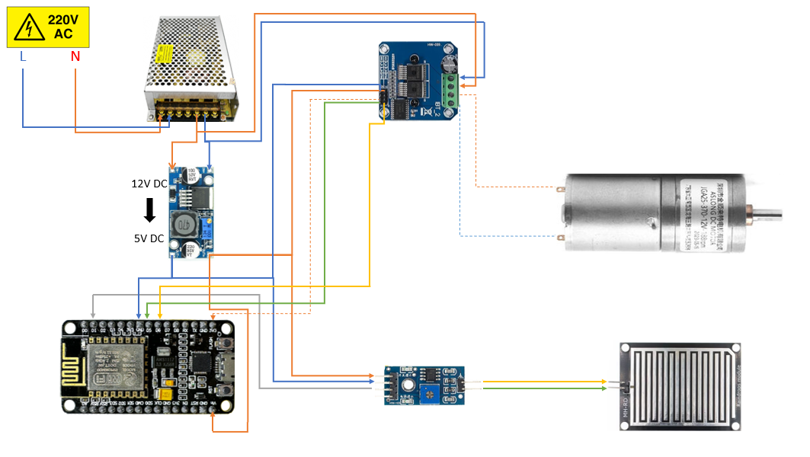

# Confirmed as-built wiring and safety notes

We assembled and operated our completed GreenGuard prototype with the NodeMCU 1.0 ESP-12E pin mapping below. The public repository still uses `ACTUATOR_DRY_RUN=true`; this safe firmware default does not change the physical connections on our prototype.

## Confirmed NodeMCU connections

| NodeMCU pin | ESP8266 GPIO | Physical connection | Function / observed status |
| --- | ---: | --- | --- |
| D1 | GPIO5 | RainDrop DO | Active-LOW; measured 3.27 V dry and 0.08 V wet |
| D5 | GPIO14 | BTS7960 RPWM | Motor-direction PWM input used by our prototype |
| D6 | GPIO12 | BTS7960 LPWM | Opposite motor-direction PWM input used by our prototype |
| D2 | GPIO4 | BTS7960 R_EN and L_EN control | Physically connected; public firmware control is disabled |
| D7 | GPIO13 | Retracted limit-switch connection | Physically connected; public limit handling is disabled |
| D0 | GPIO16 | Deployed limit-switch connection | Physically connected; public limit handling is disabled |

The connection table records our physical build. It does not establish limit-switch contact polarity, calibration, endpoint accuracy, or the mechanism's full-travel time because those behaviors were not part of our reported measurement set.

This circuit-assembly diagram is retained as supporting project media. The confirmed table above and the current firmware configuration are authoritative; the diagram is not evidence of limit-switch behavior, electrical protection, or the recorded measurements. Mains-voltage wiring is hazardous and is outside the reproducible low-voltage build guidance in this repository.

D3/GPIO0, D4/GPIO2, and D8/GPIO15 have no GreenGuard firmware assignment and participate in ESP8266 boot selection. Avoid using them for added peripherals without reviewing the required boot levels.

## Public firmware configuration

The committed firmware deliberately separates safe defaults from the as-built hardware:

| Setting | Committed value | Effect in the public build |
| --- | --- | --- |
| `ACTUATOR_DRY_RUN` | `true` | Controller logic runs while RPWM and LPWM remain LOW |
| `CONTROL_BTS_ENABLE` | `false` | D2 is not configured or driven as an enable output |
| `USE_LIMIT_SWITCHES` | `false` | D7 and D0 are not read by the controller; position remains time-estimated |
| `LIMIT_ACTIVE_LOW` | `true` | Firmware setting reserved for an enabled-switch build; not a measured claim about our switch contacts |

Do not change these flags merely because the physical wires exist. Any actuator-enabled or switch-enabled build requires a separate electrical review and controlled test.

## R_EN and L_EN safety

Our prototype connects R_EN and L_EN control to D2/GPIO4. Before setting `CONTROL_BTS_ENABLE=true`, measure the enable node and confirm the module input arrangement. No external 5 V source may share a node connected to an ESP8266 GPIO. Never apply 5 V or 12 V to D2 or any other ESP8266 GPIO.

With the committed `CONTROL_BTS_ENABLE=false`, firmware does not configure or drive D2. With `ACTUATOR_DRY_RUN=true`, RPWM and LPWM remain LOW.

## Power and motor record

| Path | Confirmed or observed | Additional verification needed |
| --- | --- | --- |
| Motor power | 12 V, 10 A supply; 12.18 V before movement and 11.72 V during movement | Final fuse selection, stall current, wire and connector ratings |
| Motor output | BTS7960/HW-039 drove the 12 V geared motor through 10 loaded deploy–retract cycles | Exact terminal polarity and physical direction mapping before rewiring |
| Controller supply | XL4005 step-down module; lowest observed 3V3 rail was 3.17 V with no NodeMCU reset | Complete power topology, ripple, and regulator thermal margin |
| Driver logic | BTS7960/HW-039 used successfully in our prototype | Recheck logic voltage and terminal labels after any wiring change |
| Ground | The system operated as assembled | Record and measure the full shared-ground topology before reproducing or modifying it |
| Rain sensor | RainDrop DO measured 3.27 V dry and 0.08 V wet | Re-measure after any sensor-supply or wiring change |

The 10 A supply rating does not determine the correct fuse by itself. Select protection from the motor's stall behavior and the ratings of the supply, driver, wire, connectors, and disconnect. Keep a reachable physical emergency disconnect during powered testing.

The [mechanical assembly clip](images/greenguard-mechanical-assembly-demo.mp4) is also retained as visual evidence of the prototype structure. It is not a recording of the ten-cycle validation campaign.

See the [hardware record](HARDWARE_AUDIT.md) and [hardware test checklist](HARDWARE_TEST_CHECKLIST.md) before reproducing or changing the system.
